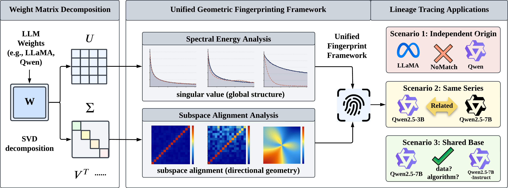

<div align='center'>

# Who Built This Model? Tracing LLM Lineage via Spectral Fingerprints in Weight Space

[](https://colmweb.org/)
[](../../issues)
[](./LICENSE)
[](https://www.python.org/)
[](../../stargazers)

</div>

<table align="center">
  <tr>
    <td align="center">
      
      <br>
      <em style="font-size: 11px;"><strong style="font-size: 11px;">Figure 1:</strong> SVD splits each weight matrix into spectral energy (&Sigma;), which separates model families and scales, and subspace alignment (U), which resolves differences among closely related models.</em>
    </td>
  </tr>
</table>

This is the official code repository for the COLM 2026 paper [**Who Built This Model? Tracing LLM Lineage via Spectral Fingerprints in Weight Space**](https://arxiv.org/abs/XXXX.XXXXX).

Open-weight LLMs are built on top of one another through fine-tuning, alignment, distillation, and merging. The result is a tangled lineage that matters for provenance and IP governance. Do LLMs carry intrinsic **biometrics**, signatures readable from weights alone, with no prompts, no outputs, and no training data?
They do. An SVD of each weight matrix gives two complementary fingerprints. **Spectral energy** (the *Trace* metric) tells independently trained models from same-series ones. **Subspace alignment** separates shared-base models that differ only in post-training, exactly where existing white-box metrics all saturate near 1.0. Together they recover a clear lineage hierarchy across 110+ open-weight pairs.

## News

- 📢 [Aug 2026] We released the code and posted our paper on [arXiv](https://arxiv.org/abs/2608.07786)! 🚀
- 🎉 [Jul 2026] Our paper has been accepted by **COLM 2026**! ✨

## Table of Contents

- [Two Fingerprints](#two-fingerprints)
- [Installation](#installation)
- [Quick Start](#quick-start)
- [How It Works](#how-it-works)
- [Reproducing the Paper](#reproducing-the-paper)
- [Hyper-parameters](#hyper-parameters)
- [Fingerprint Cache](#fingerprint-cache)
- [Repository Layout](#repository-layout)
- [Cite This Work](#cite-this-work)

## Two Fingerprints

| | Independent origin | Same series | Shared base | Data scale | Algorithm |
|---|:---:|:---:|:---:|:---:|:---:|
| AWM / HuRef / PDF | ✗ | ✗ | ✓ | ✗ | ✗ |
| Trace (Sec. 4) | ✓ | ✓ | ✓ | ✗ | ✗ |
| Subspace Alignment (Sec. 5) | n/a | n/a | ✓ | ✓ | ✓ |
| **Ours**  | **✓** | **✓** | **✓** | **✓** | **✓** |

| `--method` | Answers | Works on | Cost |
|---|---|---|---|
| `trace` | Are these two models related at all? | **any** pair, any architecture or depth | Frobenius norm, no SVD |
| `subspace` | How far has this variant moved from its base? | same architecture and depth | truncated SVD per matrix |
| `both` | both of the above | same architecture and depth | both of the above |

## Installation

```bash
git clone https://github.com/OPTML-Group/LLM-Biometrics
cd LLM-Biometrics

conda create -n llm-bio python=3.9 -y
conda activate llm-bio
pip install -r requirements.txt
```

Reference environment: Python 3.9, `torch` 2.8, `transformers` 4.57, `numpy` 2.0, `scipy` 1.13. Only extraction needs torch, since scoring is numpy only. One GPU handles models up to ~14B. Pass `--multi-gpu` to shard larger ones.

## Quick Start

```bash
python -m llm_biometrics compare \
    --model-a Qwen/Qwen2.5-7B \
    --model-b Qwen/Qwen2.5-7B-Instruct \
    --method both --components all
```

```
========================================================================
Qwen/Qwen2.5-7B
Qwen/Qwen2.5-7B-Instruct
========================================================================

Trace  (Sec. 4, Eq. 5): spectral energy across layers
    OVERALL    +0.9980   very high: shared base or near identical weights

Subspace  (Sec. 5, Eq. 8): k=512, J=3, bottom 3 layers
    OVERALL    0.8234   well aligned: shared base with moderate post-training
========================================================================
```

Trace says *these share a base*. Subspace says *how far the instruct variant rotated away from it*, the number no prior white-box method resolves. AWM, HuRef and PDF all report 0.999 to 1.000 on this pair.

As a library:

```python
from llm_biometrics import pipeline

record = pipeline.compare("meta-llama/Llama-3.1-8B",
                          "allenai/Llama-3.1-Tulu-3-8B", method="both")

record["trace"]["score"]              # scalar, Eq. 5
record["subspace"]["score"]           # scalar, Alg. A2
record["subspace"]["per_component"]   # S_c for Q, K, V, O, FFN_*
record["subspace"]["per_layer"]["Q"]  # layer-wise curve S_Q^(l)
```

## How It Works

A model is a set of weight matrices $\theta = \\{\mathbf{W}_c^{(l)}\\}$ over layers $l$ and components $c \in \\{Q, K, V, O, \text{FFN}_{\text{UP}}, \text{FFN}_{\text{DOWN}}, \text{FFN}_{\text{GATE}}\\}$.

**Trace** summarizes each matrix by its spectral energy, stacks it over layers, then correlates two models' curves after resampling to a common depth and z-scoring:

$$t(\mathbf{W}) = \sqrt{\mathrm{tr}(\mathbf{W}^\top\mathbf{W})} = \sqrt{\sum\nolimits_i \sigma_i^2}
\qquad
S(\theta_a, \theta_b) = \mathbb{E}_c\big[\mathrm{Corr}(\tilde{\tau}_c(\theta_a), \tilde{\tau}_c(\theta_b))\big]$$

Normalizing away depth and magnitude is what lets a 3B and a 14B model be compared. Trace separates independent-origin from same-series pairs at **AUC 0.850**, vs 0.655 for PDF and 0.256 for AWM.

**Subspace Alignment** handles the shared-base regime, where spectra are near-identical but direction still differs. From the top-$k$ left singular vectors it builds $\mathbf{C}_c^{(l)} = \mathbf{U}_{c,k}^{(l)}(\theta_a)^\top \mathbf{U}_{c,k}^{(l)}(\theta_b)$, whose singular values are cosines of principal angles. The signal lives in the **worst-aligned** directions:

$$S_c^{(l)} = \frac{1}{J} \sum\nolimits_{i \in \mathcal{I}_J} \sigma_i(\mathbf{C}_c^{(l)}) \in [0, 1]$$

then averages the $K_{\text{layer}}$ least-aligned layers per component, and the components. It tracks post-training **data scale** (0.976 → 0.889 as Alpaca SFT grows 10% → 100%) and **algorithm** (DPO, PPO and RAFT leave distinct per-component signatures, with $Q$ varying most and $K$/$V$ barely moving).

## Reproducing the Paper

The Appendix B model zoo ships as pair lists in [`configs/pairs/`](./configs/pairs/), one `model_a  model_b` per line:

| Pair list | Regime | Pairs | Paper |
|---|---|:---:|---|
| `s1_independent_origin.txt` | different organizations, no shared base | 27 | App. B.1, Table A1 |
| `s2_same_series.txt` | same series, different scale | 10 | App. B.2, Table A2 |
| `s3_shared_base.txt` | shared base, post-training variants | 20 | App. B.3, Tables 2 / A3 / A7 |
| `cross_series.txt` | Qwen2.5 vs Qwen3, intermediate case | 4 | App. F, Table A5 |

One script per scenario, all sharing one fingerprint cache:

```bash
# optional: pre-build the cache, e.g. to run extraction and scoring as separate jobs
bash scripts/extract_fingerprints.sh --from-pairs configs/pairs/s3_shared_base.txt

bash scripts/run_s1_independent_origin.sh    # Trace, 27 pairs
bash scripts/run_s2_same_series.sh           # Trace, 10 pairs
bash scripts/run_s3_shared_base.sh           # Trace + Subspace, 20 pairs
bash scripts/run_cross_series.sh             # Trace, 4 pairs
```

Ablations are one environment variable away:

```bash
NOISE_STD=0.0001 bash scripts/run_s1_independent_origin.sh   # perturbation, Tables A1-A3
J=1 bash scripts/run_s3_shared_base.sh                       # J ablation, Table A6
CACHE_DIR=/scratch/$USER/fp bash scripts/run_s3_shared_base.sh
```

Each pair appends a JSON record with the overall score, per-component scores, and the full per-layer subspace curve. Failed pairs are recorded and the sweep continues.

> [!NOTE]
> Two caveats before comparing against the printed tables. The four Alpaca lines in `s3_shared_base.txt` are local SFT checkpoints, so repoint them at your own (LLaMA-Factory, lr 1e-5, 3 epochs, batch 128, stratified Alpaca subsamples, seed 42, App. J). Also, the cached bases behind the reported subspace numbers use $k = 512$ while Sec. 5 describes $k = 256$. Eq. (8) reads the least-aligned tail, so the score is stable across that range but not identical.

## Hyper-parameters

| Flag | Default | Meaning |
|---|:---:|---|
| `--components` | `all` | Component types $c$ to use. The paper uses all seven. |
| `--top-k` | `512` | Singular directions retained per matrix, $k$ (subspace only). |
| `-J` | `3` | Least-aligned directions averaged per layer, Eq. (8). |
| `--n-bottom` | `3` | Least-aligned layers averaged per component, $K_{\text{layer}}$. |
| `--noise-std` | `0.0` | Gaussian weight perturbation before extraction. |
| `--multi-gpu` | off | Shard the model across visible GPUs. |

Scores rise monotonically with $J$ while the ordering across post-training settings stays fixed (Table A6). The choice affects scale, not conclusions.

## Fingerprint Cache

Extraction is the expensive step, so it is cached per model and reused by every pair mentioning it. `llm_biometrics/cache.py` owns the layout:

| File | Contents | Size |
|---|---|---|
| `<model>_trace_fingerprint.npz` | one energy value per layer per component | a few kB |
| `<model>_svd_bases.pkl` | top-$k$ singular vectors + values, per layer | **several GB** |
| `<model>_noise_<sigma>_*` | the same, after Gaussian perturbation | as above |

> [!IMPORTANT]
> Fingerprints are never written into the repository. The cache defaults to `~/.cache/llm-biometrics`. Override it per run with `--cache-dir` or `CACHE_DIR`, or globally with `export LLM_BIOMETRICS_CACHE=/scratch/$USER/llm-biometrics`.

## Repository Layout

```
llm_biometrics/
  architectures.py    component discovery across HF model families
  extract.py          weights -> trace values / top-k SVD bases
  trace.py            Sec. 4 scoring (Eq. 2-5)
  subspace.py         Sec. 5 scoring (Eq. 6-8, Alg. A2)
  pipeline.py         extract-or-load, compare, serialize
  cache.py            on-disk fingerprint cache
  defaults.py         k, J, K_layer in one torch-free module
  __main__.py         CLI: compare / extract / run-pairs
configs/pairs/        the Appendix B model zoo
scripts/              one script per scenario, plus cache building
```

To support a new model family, add a naming scheme to `_ATTENTION_SCHEMES` / `_FFN_SCHEMES` in `architectures.py`, the only file that knows how weights are named. Fused-QKV architectures (Falcon, Pythia, Phi-3) expose the fused matrix as `Q`. Missing components are skipped, and each pair is compared on the components both models share.

## Cite This Work

If you found our code or paper helpful, please cite our work~

```
@article{chen2026built,
  title={Who Built This Model? Tracing LLM Lineage via Spectral Fingerprints in Weight Space},
  author={Chen, Yiwei and Shang, Bingqi and Liu, Sijia},
  journal={arXiv preprint arXiv:2608.07786},
  year={2026}
}
```
